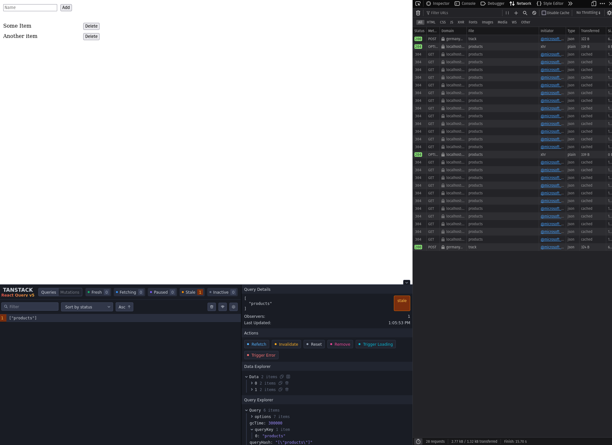
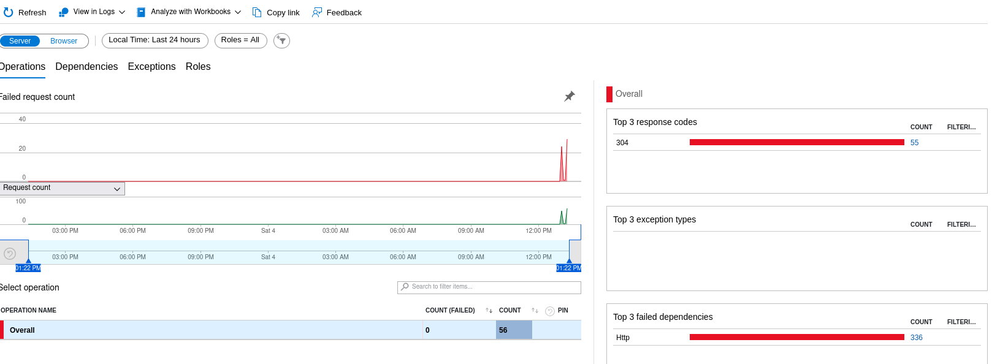

# AppInsights SDK / Azure OTel Distro Repro

Reproduces the issue mentioned in [#2266](https://github.com/microsoft/ApplicationInsights-JS/issues/2266) & [#29398](https://github.com/Azure/azure-sdk-for-js/issues/29398).

This repo provides a simple web application that allows adding/removing items to/from a list. Items are fetched from an API (Node/Express) and persisted to MongoDB.

1. Create `.env` files in `frontend` & `backend`. Copy from `.env.template` and add connection strings of the AI resources.
2. Start mongo container with `docker compose up -d`.
3. Install dependencies at `/frontend` and `/backend` with `yarn`.
4. Start applications at `/frontend` and `/backend` with `yarn dev`.

## Repro-Steps for [#29398](https://github.com/Azure/azure-sdk-for-js/issues/29398)

- Make sure 'disable cache' setting in unticked in your browser dev. tools
- Start web client, api and db as described above
- Add some items
- Trigger multiple calls of GET `/products` endpoint
  - Open Tanstack Query DevTools (small island symbol - bottom right corner)
  - Select `["products"]`, hit invalidate a few times to trigger a refetch of all 'products'
- Should see multiple 304's in your network tab
- Check application insights transaction search - shows successful requests with 304 response code
- Check Overview failed requests or Failures, there's a spike in failed requests
- When clicking on 'Top 3 response codes' and then '304', there are no available results

